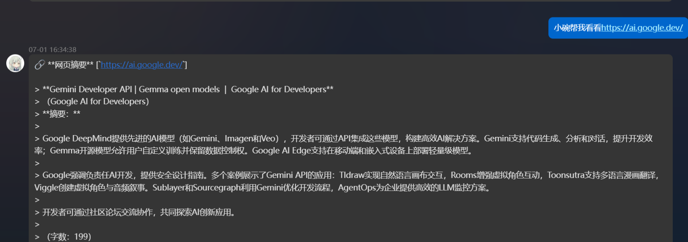

# 麦麦BOT 网页摘要插件

本插件可自动识别聊天消息中的网址，并智能生成网页摘要，适用于新闻、门户、高校官网、博客等主流页面。

## 功能亮点

- **自动识别多种网址格式**（如 http、https、www、.com、.cn 等）
- **智能内容提取**：优先 meta/og 描述，其次正文、标题，支持多种网页结构
- **可选 LLM（大模型）智能摘要/按句摘要/硬截断**
- **自动抓取站内相关页面摘要**，最多可自定义抓取数
- **防刷屏防重复机制**：同内容 10 分钟内不重复回复
- **丰富配置，自动适配 Clash 代理或直连**
- **兼容主流新闻/门户/高校/博客等网站**

## 环境依赖

确保 Python 环境安装以下依赖：
- `aiohttp`（异步网页请求，支持 http/socks5 代理）
- `beautifulsoup4`（HTML 解析）
- `chardet`（编码自动检测）
- `readability-lxml`（可选，正文提取更准）

安装命令：

```bash
pip install aiohttp beautifulsoup4 chardet readability-lxml
# 如需 socks5 代理支持（如 Clash 的 socks5 端口），请安装：
pip install aiohttp[socks]
```

## 使用方法

1. 将 `plugin.py` 放入你的插件目录
2. 配置 `config.toml`（参数见下）
3. 启动 BOT，插件自动生效

## 配置参数说明

```toml
[general]
enabled = true                # 插件总开关
enable_group = true           # 群聊生效
enable_private = true         # 私聊生效

[http]
timeout = 10                  # 单次请求超时（秒）
user_agent = "Mozilla/5.0 (compatible; MaiBot-URL-Summary/1.0)"
max_retries = 3               # 最大重试次数
proxy = "http://127.0.0.1:7890" # 代理地址，默认自动走 Clash 本地代理，如需直连请设为 ""

[processing]
max_length = 400              # 主摘要最大长度
include_title = true          # 是否包含标题
min_content_length = 100      # 最小正文长度
max_subpage = 2               # 相关页面最大抓取数
subpage_length = 200          # 相关页面摘要最大字数
enable_related_pages = true   # 是否抓站内相关页面
summary_mode = "sentence"     # 摘要方式："llm"（大模型）、"sentence"（按句，默认）、"plain"（硬截断）
llm_config_key = "utils_small" # LLM摘要时用的模型配置key

[cache]
cache_ttl = 600               # 防重复缓存时间（秒）
```

### 详细说明

- **代理支持**
  - 默认自动走 Clash 的 http 代理（`http://127.0.0.1:7890`）。
  - 如需 socks5 代理（如 `socks5://127.0.0.1:7891`），请修改 proxy 并确保安装 aiohttp[socks]。
  - 若希望直连，请将 `proxy` 设为 `""`。

- **摘要生成优先级**：meta/og 描述 > 正文内容 > 标题
- **相关页面摘要**：自动抓取同站下最多 `max_subpage` 个内链，去重过滤广告/无内容
- **防重复机制**：10 分钟内相同 URL 和内容不再回复
- **大模型摘要（LLM）**：如需 LLM 摘要，`summary_mode` 设为 `llm`，`llm_config_key` 配置你的模型名（如 `utils_small`、`replyer_1` 等）

## 常见问题

- **内容乱码或缺失？**  
  请确保已安装 `chardet` 和 `readability-lxml`，可尝试调整 `user_agent` 配置。
- **页面无摘要？**  
  可能网页结构特殊或反爬较强，欢迎反馈具体网址以助优化。
- **外网无法访问？**  
  请确认 `proxy` 配置正确（如 Clash 已运行，端口无误），如需直连请将 proxy 留空。

## 更新日志

- 支持 LLM 智能摘要与模型选择
- 自动抓取相关页面摘要
- 内容检测与防重复机制优化
- 默认自动适配 Clash 本地代理

---

如有建议或 bug 欢迎 issue！
