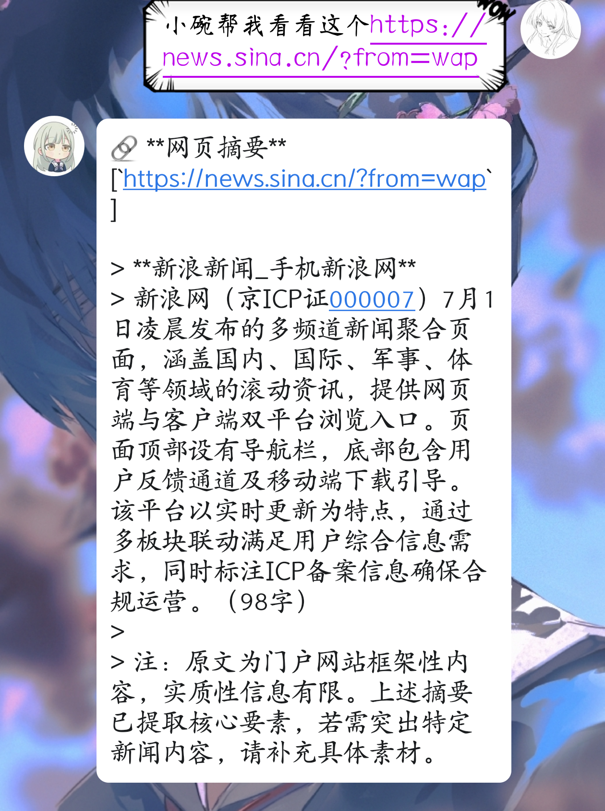

````markdown name=README.md
# 麦麦BOT 网页摘要插件

本插件可以自动识别聊天消息中的网址，并生成简明网页摘要。适用于大多数新闻、门户、学校官网、博客等页面。

## 功能简介

- **自动识别各种常见网址格式**（支持 http、https、www、.com、.cn 等）
- **智能提取网页正文、meta描述、新闻段落**，并自动生成摘要
- **自动抓取同站内相关页面**（如新闻详情、栏目页），并为每个相关页面生成简明摘要
- **防刷屏防重复机制**：10分钟内同一内容不重复回复
- **兼容主流新闻/门户/高校/博客等网页结构**
- **支持三种摘要方式**：  
  - `llm`（大模型智能摘要，需配合 LLM 模型）
  - `sentence`（按句截断，默认）
  - `plain`（硬截断）

## 依赖说明

请确保 Python 环境已安装以下依赖：

- `aiohttp`：异步请求网页内容
- `beautifulsoup4`：解析网页结构
- `chardet`：自动检测网页编码
- `readability-lxml`（可选，推荐）：更智能地抽取正文

安装依赖示例：

```bash
pip install aiohttp beautifulsoup4 chardet readability-lxml
```

## 使用方法

1. 将 `plugin.py` 文件放入你的插件目录
2. 根据需求修改 `config.toml` 配置文件（参数详见下文）
3. 启动BOT，插件即可自动生效

## 配置参数说明

```toml
[general]
enabled = true                # 插件开关
enable_group = true           # 群聊开关
enable_private = true         # 私聊开关

[http]
timeout = 10                  # 请求超时时间（秒）
user_agent = "Mozilla/5.0 (compatible; MaiBot-URL-Summary/1.0)"
max_retries = 3               # 最大重试次数

[processing]
max_length = 400              # 摘要最大长度
include_title = true          # 是否包含标题
min_content_length = 100      # 最小内容长度
max_subpage = 2               # 相关页面最多抓几个
subpage_length = 200          # 相关页面摘要最大字数
enable_related_pages = true   # 是否抓取站内相关页面
summary_mode = "sentence"     # 摘要方式，可选 "llm"（大模型摘要）、"sentence"（按句）、"plain"（硬截断）
llm_config_key = "utils_small" # LLM摘要时用的模型配置key（如 utils_small, replyer_1, replyer_2 等）

[cache]
cache_ttl = 600               # 防重复缓存时间（秒），默认10分钟
```

### 说明

- **摘要生成优先级**：meta描述 > og描述 > 正文段落 > 页面标题
- **相关页面**：自动抓取同一网站下最多 `max_subpage` 个链接，自动跳过重复/无内容/广告页
- **防重复机制**：10分钟内同样URL和内容不会重复回复
- **大模型摘要**（LLM）：如需用 LLM 生成摘要，`summary_mode` 设为 `llm`，并配置 `llm_config_key` 为你可用的模型分组（如 `utils_small`, `replyer_1`，详见你的 LLM 配置）

## 常见问题

- **网页乱码/内容缺失？**  
  请确保已安装 `chardet` 和 `readability-lxml`，并尝试调整 `user_agent` 配置。
- **页面无摘要？**  
  可能该网页内容结构特殊或反爬较强，可以反馈具体网址以便优化。

## 更新日志

- 支持 LLM 智能摘要和模型选择
- 支持自动抓取相关页面摘要
- 优化内容提取和防重复机制

---
